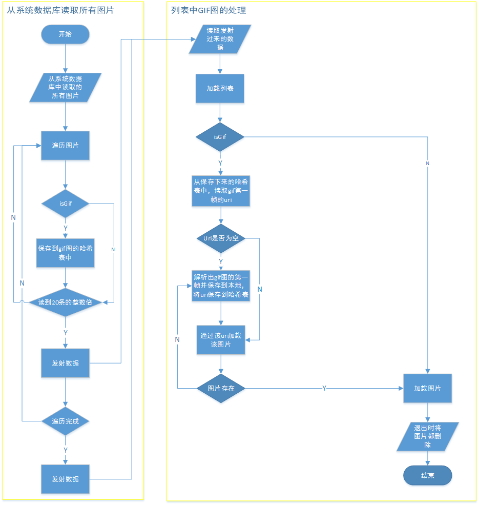
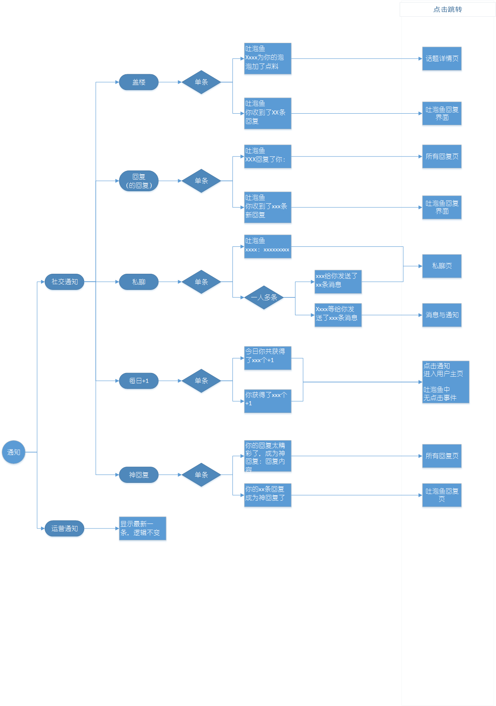

<meta http-equiv="Content-Type" content="text/html; charset=utf-8">

Zhang Ruofan's Weekly Report
===================

from 2016.4.25 to 2016.5.6
---------------------------------

## <i class="icon-pencil"></i>Functions

> - 修改up逻辑

> - 修改自定义图片控件的图片加载逻辑,避免图片过多造成的延时

> - 修改加载优先级,优化第三方图片控件的加载速度

> - 优化原图选择细节,新增图片大小显示

> - 删除设置头像后的内存缓存,避免重新登陆导致头像显示为前一个账户的

> - 解决魅族手机截屏不显示问题

> - 分析同类图片应用的实现逻辑

> - 设计一套Gif图优化逻辑
    

> - 梳理并总结通知的各种形式及逻辑 

## <i class="icon-pencil"></i>Milestones And Roadblocks

> - 重新回顾流程图并将gif图的优化逻辑以及通知的表现形式表示出来

> - 学习retrofit + rxjava的token失效的重试机制

> - 了解多线程中单个线程的静态方法及静态变量会不会造成数据紊乱

> - 学习service源码

## <i class="icon-pencil"></i>Plans For Next Week

> - 修改通知模块

> - 解决所有bug

> - 学习图片框架的源码

> - 在原有框架上优化gif图模块

